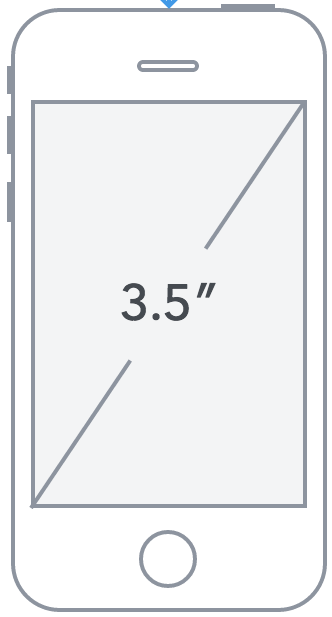
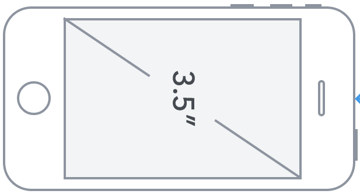
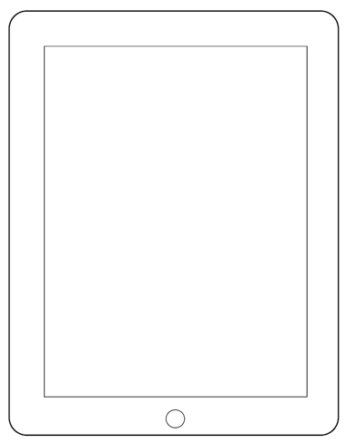
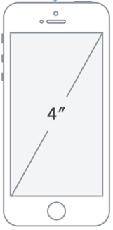
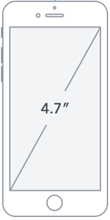
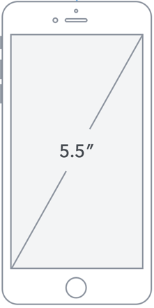
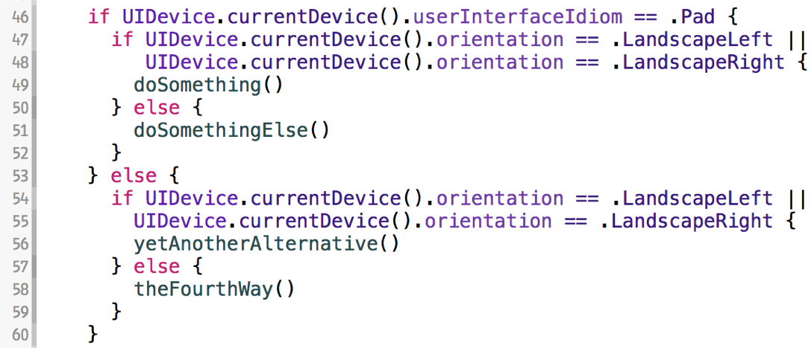
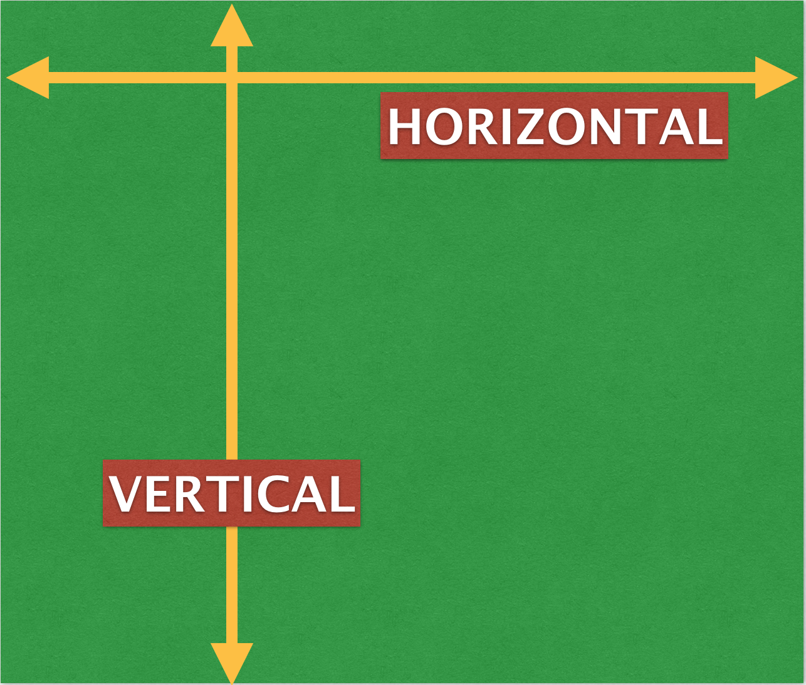
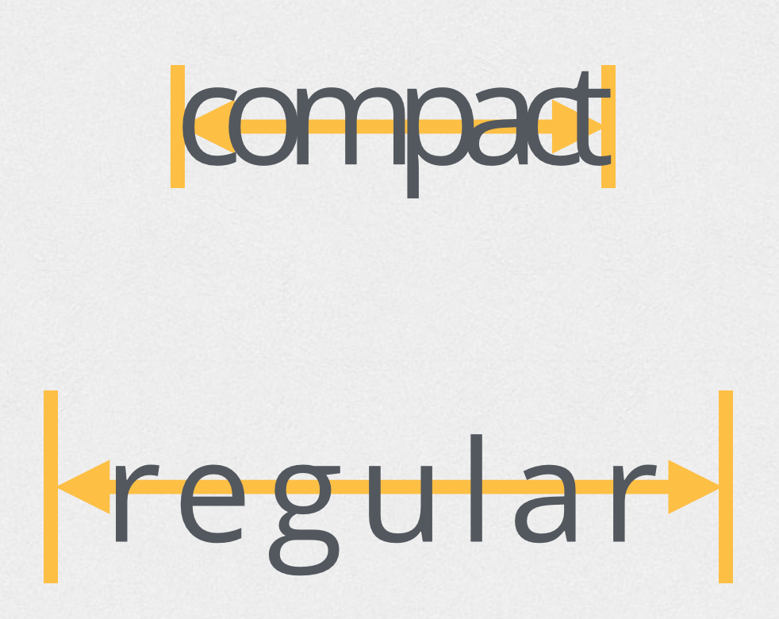
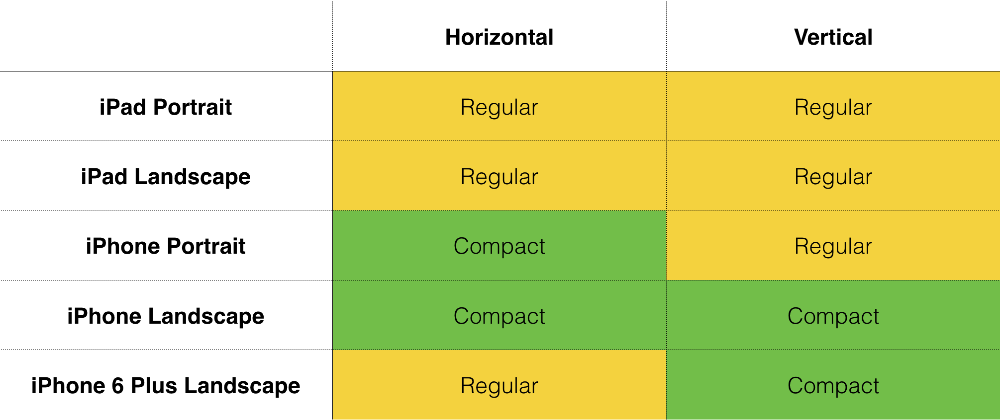

# Adaptive Layout Workshop
## Sam Davies
## [@iwantmyrealname](https://twitter.com/iwantmyrealname)

[github.com/sammyd/adaptive-layout-workshop](https://github.com/sammyd/adaptive-layout-workshop)

---

# ShinobiControls

[shinobicontrols.com/giveaway](http://www.shinobicontrols.com/giveaway)

---

## Requirements

- Xcode 6.1
- __AdaptiveWeaponry__ sample project

---

## Plan

- AutoLayout refresher
- Intro to size classes
- Installable constraints
- Handling rotation in a post-rotation world
- Adaptive fonts
- Configurable constraints
- Installable Views

---

# Auto Layout Refresher

---
# Adaptive Layout

---
## In the beginning there was...

---
## In the beginning there was...

---
## In the beginning there was...

---
## In the beginning there was...

---
## In the beginning there was...

---
## In the beginning there was...

---
## In the beginning there was...

## ...a total of 10 different layouts

---

## in the past

---

# this doesn't scale

---
## introducing Adaptive Layout

- Abstracts layout away from device specifics
- Introducing concept of size classes
- Available in iOS 8
- Fully supported in Xcode and IB

---
# "amount of space available for content"

---
## Size classes

---

## Size classes

---

## Size classes

---

## Approach to adaptive layout

1. Build base layout
2. Choose size class override
3. Uninstall irrelevant constraints
4. Add new constraints specific to size class
5. Rinse and repeat

---

# Let's Go!

---

## Useful Links

sam ⇄ [@iwantmyrealname](https://twitter.com/iwantmyrealname)

code ⇄ [github.com/sammyd/adaptive-layout-workshop](https://github.com/sammyd/adaptive-layout-workshop)

free book ⇄ [shinobicontrols.com/ios8](http://shinobicontrols.com/ios8)

competition ⇄ [shinobicontrols.com/giveaway](http://www.shinobicontrols.com/giveaway)

# Thanks!

